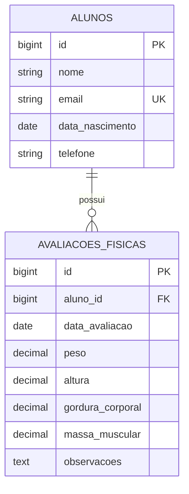

# Fitness Assessment System

Sistema web para gerenciamento de alunos e avaliações físicas de uma academia. A aplicação centraliza dados cadastrais e indicadores corporais, oferecendo uma interface autenticada para acompanhar registros de peso, altura, percentual de gordura e massa muscular.

## Funcionalidades

- Autenticação de usuários
- Cadastro, edição e exclusão de alunos
- Busca de alunos por nome
- Cadastro e gerenciamento de avaliações físicas
- Associação de múltiplas avaliações a cada aluno
- Registro de peso, altura, gordura corporal e massa muscular
- Paginação das listagens
- Validação dos dados enviados pelos formulários
- Exclusão em cascata das avaliações ao remover um aluno

## Tecnologias


- **Back-end:** PHP, Laravel e Eloquent ORM
- **Front-end:** Blade, Bootstrap, Tailwind CSS e Alpine.js
- **Banco de dados:** PostgreSQL
- **Build:** Vite e npm
- **Testes:** PHPUnit

## Arquitetura

O projeto segue o padrão MVC do Laravel:

- **Models:** representam alunos, avaliações físicas e usuários
- **Views:** interfaces Blade para autenticação, painel e operações de cadastro
- **Controllers:** concentram validações e regras dos fluxos de alunos e avaliações
- **Migrations:** versionam a estrutura do banco e seus relacionamentos
- **Routes:** expõem recursos REST protegidos por autenticação

## Modelo de dados



## Como executar

### Pré-requisitos

- PHP 8.2 ou superior
- Composer
- Node.js e npm
- PostgreSQL

### Instalação

1. Entre na pasta do projeto e instale as dependências:

```bash
composer install
npm install
```

2. Crie o arquivo de ambiente:

```bash
cp .env.example .env
php artisan key:generate
```

No Windows PowerShell, use `Copy-Item .env.example .env`.

3. Configure a conexão no arquivo `.env`:

```env
DB_CONNECTION=pgsql
DB_HOST=127.0.0.1
DB_PORT=5432
DB_DATABASE=fitness_assessment
DB_USERNAME=postgres
DB_PASSWORD=sua_senha
```

4. Crie as tabelas e o usuário de demonstração:

```bash
php artisan migrate --seed
```

5. Inicie o back-end:

```bash
php artisan serve
```

6. Em outro terminal, inicie o Vite:

```bash
npm run dev
```

A aplicação estará disponível em `http://localhost:8000`.

## Acesso de demonstração

```text
E-mail: admin@academia.com
Senha: senha123
```

As credenciais são destinadas exclusivamente ao ambiente local.

## Testes

```bash
php artisan test
```

## Estrutura principal

```text
app/
├── Http/Controllers/     # Fluxos de alunos e avaliações
└── Models/               # Entidades e relacionamentos
database/
├── migrations/           # Estrutura do banco de dados
└── seeders/              # Usuário inicial
resources/views/
├── alunos/               # Telas de gerenciamento de alunos
├── avaliacoes/           # Telas de avaliações físicas
└── layouts/              # Layout da aplicação
routes/
└── web.php               # Rotas web protegidas
```

## Destaques técnicos

- Rotas RESTful com `Route::resource`
- Relacionamento um-para-muitos com Eloquent ORM
- Proteção de rotas por middleware de autenticação
- Validação de dados no servidor
- Reutilização de formulários com partials Blade
- Integridade referencial por chave estrangeira e exclusão em cascata
