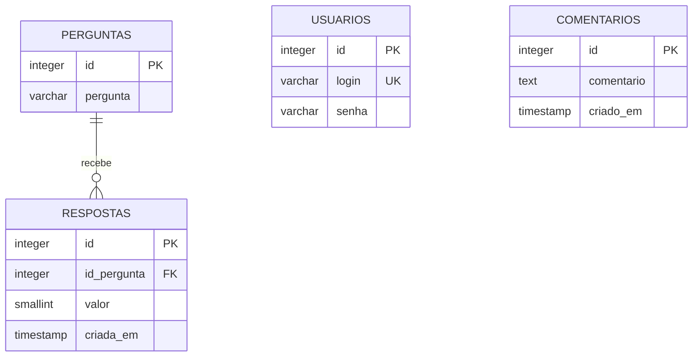

# Hospital Feedback System

Sistema web de pesquisa de satisfação hospitalar desenvolvido para coletar avaliações anônimas sobre a experiência dos pacientes. A aplicação apresenta perguntas sequenciais, registra notas de 0 a 10 e permite o envio de um comentário opcional ao final do questionário.

O projeto também possui uma área administrativa autenticada para consultar e gerenciar as perguntas utilizadas na pesquisa.

## Funcionalidades

- Questionário de satisfação com perguntas sequenciais
- Escala visual de avaliação de 0 a 10
- Registro anônimo das respostas
- Campo opcional para comentários
- Navegação dinâmica entre perguntas com Fetch API
- Tela de agradecimento com redirecionamento automático
- Login administrativo baseado em sessão
- Listagem e manutenção das perguntas da pesquisa
- Interface adaptável para diferentes tamanhos de tela

## Tecnologias


- **Back-end:** PHP e PDO
- **Front-end:** HTML, CSS e JavaScript
- **Banco de dados:** PostgreSQL
- **Comunicação assíncrona:** Fetch API e JSON
- **Autenticação:** sessões PHP

## Fluxo da aplicação

1. O paciente acessa a pesquisa sem informar dados pessoais.
2. Cada pergunta é apresentada individualmente.
3. O paciente seleciona uma nota entre 0 e 10.
4. A resposta é enviada ao servidor de forma assíncrona.
5. Ao concluir as perguntas, o paciente pode deixar um comentário.
6. A aplicação exibe uma mensagem de agradecimento e reinicia o fluxo.

## Arquitetura

O projeto utiliza uma organização simples por responsabilidades:

```text
hospital-feedback-system/
|-- js/                     # Navegação e envio assíncrono dos dados
|-- public/css/             # Estilos compartilhados
|-- src/
|   |-- assets/             # Recursos visuais
|   |-- controllers/        # Login, respostas, comentários e perguntas
|   |-- database/           # Configuração da conexão PostgreSQL
|   `-- pages/              # Interfaces da pesquisa e administração
`-- README.md
```

## Modelo de dados



## Como executar

### Pré-requisitos

- PHP 8 ou superior com a extensão `pdo_pgsql`
- PostgreSQL
- Navegador web moderno

### Banco de dados

1. Crie um banco chamado `projetohospital`.
2. Execute o SQL abaixo nesse banco:

```sql
CREATE TABLE usuarios (
    id SERIAL PRIMARY KEY,
    login VARCHAR(100) UNIQUE NOT NULL,
    senha VARCHAR(255) NOT NULL
);

CREATE TABLE perguntas (
    id SERIAL PRIMARY KEY,
    pergunta VARCHAR(500) NOT NULL
);

CREATE TABLE respostas (
    id SERIAL PRIMARY KEY,
    id_pergunta INTEGER NOT NULL REFERENCES perguntas(id) ON DELETE CASCADE,
    valor SMALLINT NOT NULL CHECK (valor BETWEEN 0 AND 10),
    criada_em TIMESTAMP DEFAULT CURRENT_TIMESTAMP
);

CREATE TABLE comentarios (
    id SERIAL PRIMARY KEY,
    comentario TEXT,
    criado_em TIMESTAMP DEFAULT CURRENT_TIMESTAMP
);

INSERT INTO usuarios (login, senha)
VALUES ('admin', 'admin123');

INSERT INTO perguntas (pergunta) VALUES
    ('Como você avalia a qualidade do atendimento recebido?'),
    ('Como você avalia a cordialidade da equipe?'),
    ('Como você avalia a estrutura e a limpeza do hospital?');
```

> A autenticação atual foi criada para fins acadêmicos e compara a senha diretamente. Em um ambiente de produção, utilize `password_hash()` e `password_verify()`.

### Configuração

Atualize as credenciais em `src/database/database.php`:

```php
$host = 'localhost';
$dbname = 'projetohospital';
$user = 'postgres';
$password = 'sua_senha';
```

### Servidor local

Na raiz do projeto, execute:

```bash
php -S localhost:8000
```

Acesse:

- Pesquisa: `http://localhost:8000/src/pages/perguntas/index.php`
- Administração: `http://localhost:8000/src/pages/login/admin.php`

Com o SQL de exemplo, o acesso administrativo é:

```text
Usuário: admin
Senha: admin123
```

## Endpoints principais

| Endpoint | Responsabilidade |
| --- | --- |
| `getPerguntas.php` | Retorna a próxima pergunta em JSON |
| `salvar_resposta.php` | Registra a nota atribuída a uma pergunta |
| `salvar_comentario.php` | Armazena o comentário opcional |
| `login.php` | Valida o acesso administrativo |

## Destaques técnicos

- Consultas parametrizadas com PDO
- Persistência assíncrona sem recarregar a página
- Respostas associadas às perguntas por chave estrangeira
- Validação da escala de notas no banco de dados
- Separação entre páginas, controllers, recursos visuais e conexão
- Proteção da área administrativa por sessão

## Próximas melhorias

- Armazenar senhas com hash seguro
- Mover credenciais do banco para variáveis de ambiente
- Finalizar a integração visual das ações de adicionar, editar e excluir perguntas
- Criar um painel com indicadores e médias das avaliações
- Adicionar proteção CSRF e validação mais rigorosa das entradas
- Implementar testes automatizados

## Contexto acadêmico

Projeto desenvolvido como atividade da disciplina de Desenvolvimento Web, com foco na integração entre interface, requisições assíncronas, PHP e banco de dados relacional.
